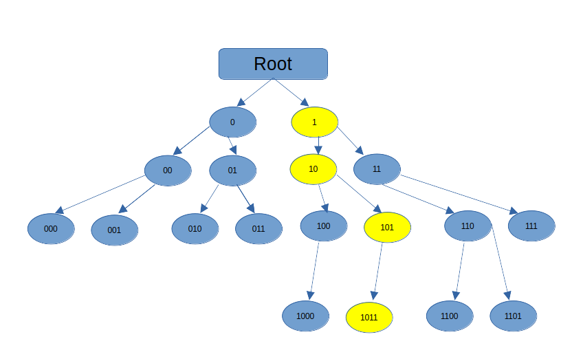

# Other Parts in this Series
- [Part 1 Introduction](https://medium.com/@stevelatif/aya-rust-tutorial-part-5-using-maps-4d26c4a2fff8)
- [Part 2 Setting Up](https://medium.com/@stevelatif/aya-rust-tutorial-part-two-setting-up-33b1e489cb93)
- [Part 3 XDP Pass](https://medium.com/@stevelatif/aya-rust-tutorial-part-three-xdp-pass-c9b8e6e4baac)
- [Part 4 XDP Hello World](https://medium.com/@stevelatif/aya-rust-tutorial-part-four-xdp-hello-world-c41abf76c353)
- [Part 5 XDP Using Maps](https://medium.com/@stevelatif/aya-rust-tutorial-part-5-using-maps-4d26c4a2fff8)
- [Part 6 Simple Firewall](https://medium.com/p/b56373c8bcc6)

# Part 7 Creating Firewall with a Rest API
Welcome to Part 7. In this chapter we will rework the firewall
adding more functionality using the map type: LPM_TRIE. 
Operation and configuration will be controlled from a REST api.
Using Aya this will be fairly straight forward. All the code will be in
Rust and van be built and run from 'Cargo'. 
Using the Aya framework we can generate a basic XDP EBPF framework and then
layer the Rest API on top of the user space code using the actix crate.
The indiviudual layers, eBPF, the REST api are straightforward, figuring out
how to combine them is where the work is. 

There is a clear divide between the eBPF kernel code and
the REST API, so they can be built seperately, as we are 
already familiar with the eBPF side of things we will build tha
kernel code first and then add the REST API.

// !!!!!!TODO !!!!!!! 
// Say something about what REST is
//

Let's sketch out the design of the API. 

|    | URI                                                                              | Meaning                        | Method             | 
|----|----------------------------------------------------------------------------------|--------------------------------------------------------------------------------|----|
| 1  | /api/load -d '{"interfaces":"eth0","mode":"skb"}'                                | load the firewall, attach to specified interdace in the particular mode | POST |
| 2  | /api/unload -d '{"interface":"eth0"}'                                            | unloads the firewalls attached to the specified interface | POST |
| 3  | /api/block  -d '{"src": "10.11.12.13/32", "action" : "block", "timeout": "500"}' | block a specific address | PUT | 
| 5  | api/block   -d '{"src":"127.0.0.2/32","action":"allow","timeout":500}'           | unblock a specific address |  PUT |
| 6  | api/flushblocked                                                                 | unblock all the IP addresses and subnets  | GET |
| 7  | api/status                                                                       | get the status of all rules | GET | 
 
There is a lot here, and more functionality than we had in the first iteration of the firewall, where
packets were only being dropped on a per IP basis. The firewall was functional as soon as it was loaded,
to disable a rule blocking an address, you needed to unload the eBPF program. 

- 1 will load the firewall and attach it to a particuolar interface. 
- 2 will unload all rules on an interface
- 3 will block a range of IP addresses on an interface. In the example 10.11.12.13/32 specifies one address 
  If we change that to 10.11.12.0/24 addresses in the range 10.11.12.1 - 10.11.12.255  will be blocked. More on 
  this in the section on LPM Trie below.
- 5 unblocks a previously blocked address
- 6 Flushes all blocked addresses on all interfaces
- 7 Gives the status

All the rules should be straightforward to implement using Maps to pass
the addresses to the kernel code, but what is meant by number 7, and getting the status?
We can gather some statistics of the number of packets seen on an interface 
and report those back using a Per CPU counter as we did in the packet counter
program. We could also report packet size. Packets are layered depending on the protocol 
and packet sizes can vary

| Protocol | Max Size | Min Size  |
|---------- |-------------| --------- |
| Ethernet  | 1500 Bytes  | 64 Bytes  |
| Ethernet Jumbo Frames | 9000-9216 Bytes  |  |
| IP        | 65535 Bytes         | 21 Bytes          |
| TCP       | 65535 Bytes        | 20 Bytes           |
| UDP       | 65535 Bytes  |  8 Bytes         |
| ICMP      | 64 Bytes        | 64 Bytes          |

Packets will be dropped or passed based on their IP address which is part of the 
IP header, so it makes sense to report the size of IP packets being dropped. 

We've mentioned an LPM Trie several times, lets dig a little deeper into what that 
is. In the first version of the firewall we used a hash table to 
store the ip addresses to be blocked. This allows for fast lookup of entries but 
is not efficient in the event of a large number of addresses that need to be 
blocked. Just looking at IPv4 addresses, if we were to have a hash table with 
an entry for each address, that would be about 4 billion entries. Storing the entries as 
32 bit integers would take about 18 Gb for the addresses alone. 

The LPM - longest prefix match is used by a router to aggregate the addresses basaed on the 
subnet mask. Given an address route 10.11.0.0 with a mask of 255.255.0.0 
has the upper 16 bits set:
	11111111 11111111 00000000 00000000
	
So 16 is the prefix length. The netmask is stored as the prefix length
	10.11.0.0/16
	
An example firewall configuration might look like


|   | Address   | Subnet Mask   | Prefix | Action   |  Binary | 
|---|-----------|---------------|--------|----------|-------------------------------------|
| 1 | 10.0.0.0 | 255.0.0.0   | 8     | XDP_DROP |  00001010 00000000 00000000 00000000 |
| 2 | 10.11.0.0 | 255.255.0.0 | 16     | XDP_DROP          | 00001010 00001011 00000000 00000000 |
| 3 | 10.11.1.1 | 255.255.255.255 | 32   | XDP_REDIRECT | 00001010 00001011 00000001 00000001 |
| 4 | 10.11.1.2 | 255.255.255.255 | 32   | XDP_REDIRECT | 00001010 00001011 00000001 00000010 |
| 5 | 10.11.1.3 | 255.255.255.255 | 32   | XDP_PASS | 00001010 00001011 00000001 00000011 |

If a packet is received with destination address 10.11.1.3, we want it 
to match against entry 5 in the above table. Potentially it could match 
entries 1,2 and 5. Of these the match with the longest prefix is 5 - this
is the longest prefix match. 

A naive implementation for an LPM Trie would be a binary tree where every 
node tests one bit of the address. For a 32 bit IPv4 address this would be a
binary tree too large to fit into this page, instead consider a 4 bit addresses

- 1011


Its part of an IP address, but shortened so we can fit the nodes on the page.
If we wanted to try to get an LPM we can track it through the yellow nodes
from the top

- 1011/1
- 1011/2
- 1011/3
- 1011/4




Linux implementation can be found [here](https://github.com/torvalds/linux/blob/master/kernel/bpf/lpm_trie.c)

As usual start by creating an XDP project using the cargo template

	cargo generate https://github.com/aya-rs/aya-template 

I called the project `xdp-firewall-rest' 

Edit the file 'xdp-firewall-rest-ebpf/Cargo.toml' and add the dependency:

	network-types = "0.0.5"

In the file 'xdp-firewall-rest-ebpf/src/main.rs'
add the following code

```rust
#[map(name = "BLOCKED_IPS")]
static mut BLOCKED_IPS: LpmTrie<u32, u8> =
    LpmTrie::<u32, u8>::with_max_entries(1024, 0);

#[inline(always)]
fn ptr_at<T>(ctx: &XdpContext, offset: usize) -> Result<*const T, ()> {
    let start = ctx.data();
    let end = ctx.data_end();
    let len = mem::size_of::<T>();

    if start + offset + len > end {
        return Err(());
    }

    Ok((start + offset) as *const T)
}
```
`BLOCKED_IPS` is the `LpmTrie` map 

A naive impolementation of an LPM Trie for the above example

This version of the firewall uses an Lpm Trie to pass the ip addreses to block 
to the kernel code. 

```rust
static mut BLOCKED_IPS: LpmTrie<u32, u8> 
```

The `u32` is for the IPv4 address which gets converted from its quad dotted notation. 
The function `ptr_at` is as we have seen before to get the raw_pointer 

The main work in the ebpf code is done in the `try_xdp_firewall-rest` function

```rust
fn try_xdp_firewall(ctx: XdpContext) -> Result<u32, ()> {
    let p1 = ptr_at(&ctx, 0)?;
    let ethhdr : EthHdr = unsafe { *p1 } ;
    match ethhdr.ether_type {
        EtherType::Ipv4 => {
	    // Do nothing
	}
        EtherType::Ipv6 => {
	    return Ok(xdp_action::XDP_DROP);
	}
        _ => return Ok(xdp_action::XDP_PASS),
    }

    // parse the IP header
    let ipv4hdr : *const Ipv4Hdr = ptr_at(&ctx, EthHdr::LEN)?;
    let src_addr = u32::from_be(unsafe { (*ipv4hdr).src_addr });
    let total_length = u16::from_be(unsafe { (*ipv4hdr).tot_len });
    let dest_addr = u32::from_be(unsafe { (*ipv4hdr).dst_addr });
    
    let add = unsafe { BLOCKED_IPS.get(&Key::new(32, u32::from(src_addr).to_be()))} ;
    match add {
	None => {
	    info!(&ctx, "not matched {:i}", src_addr);
	    return Ok(xdp_action::XDP_PASS);
	}
	Some(v)  => {
	    unsafe {
			let counter = STATUS_COUNTER
				.get_ptr_mut(0)
				.ok_or(())?;
				*counter +=1;
			}
		return(Ok(xdp_action::XDP_DROP));
		}
  	}

    // parse the TCP header
    let source_port = match unsafe { (*ipv4hdr).proto } {
        IpProto::Tcp => {
            let tcphdr: *const TcpHdr =
                ptr_at(&ctx, EthHdr::LEN + Ipv4Hdr::LEN)?;
            u16::from_be(unsafe { (*tcphdr).source })
        }
        IpProto::Udp => {
            let udphdr: *const UdpHdr =
                ptr_at(&ctx, EthHdr::LEN + Ipv4Hdr::LEN)?;
            u16::from_be(unsafe { (*udphdr).source })
        }
        _ => return Err(()),
    };

    let destination_port = match unsafe { (*ipv4hdr).proto } {
        IpProto::Tcp => {
            let tcphdr: *const TcpHdr =
                ptr_at(&ctx, EthHdr::LEN + Ipv4Hdr::LEN)?;
            u16::from_be(unsafe { (*tcphdr).dest })
        }
        IpProto::Udp => {
            let udphdr: *const UdpHdr =
                ptr_at(&ctx, EthHdr::LEN + Ipv4Hdr::LEN)?;
            u16::from_be(unsafe { (*udphdr).dest })
        }
        _ => return Err(()),
    };

    info!(&ctx, "source port {} dest_port {}", source_port, destination_port);

    Ok(xdp_action::XDP_PASS)
}
```
The nested protocol structure means that we parse the ethernet header 
to get the type of network packet, then the IP header to get the source
and destination address where we check against the list of  BLOCKED_IPS
to decide if the packet is dropped. Finally the TCP header to get the source and
destination ports.

On the user space side, look at the documentation at [docs.aya-rs.dev](https://docs.aya-rs.dev/aya/maps/lpm_trie/struct.lpmtrie)
The implementation mostly follows the example on this page. 

```rust
    let mut routes : LpmTrie<_, u32, u8> =
     	LpmTrie::try_from(bpf.map_mut("BLOCKED_IPS").unwrap())?;

    let ipaddr = Ipv4Addr::new(10, 0, 0, 0);

    let key = Key::new(8, u32::from(ipaddr).to_be());
    routes.insert(&key, 1, 0)?;
```

The LpmTrie is defined in the eBPF kernel code and is referenced here using the 
name `BLOCKED_IPS` 

An ip `10.0.0.0` put into a key ` let key = Key::new(8, u32::from(ipaddr).to_be());` 
The key is the entry in the trie 
```rust
pub struct Key<K: Pod>
pub fn new(prefix_len: u32, data: K) -> Self
```
The prefix len is the number of bits which to match against, data is the address, ipv4 or ipv6
The call `to_be()` is to convert the address to network [byte order](https://en.wikipedia.org/wiki/Endianness), which is big endian. 
Be careful with this, any time you If you check your system:

```bash
$ lscpu | grep -i endian
Byte Order:                           Little Endian
```

But network order is big endian. Care must be taken to ensure that 
you are consistent with the byte order. 
Mysterious bugs caused by issues with endianess are a source of 
mysterious bugs.

At this point we can verify that the eBPF code works, build it:

```bash
cargo xtask build-ebpf
cargo build
RUST_LOG=info cargo xtask run -- -i lo
```

As the address that is being filtered is the source address `10.0.0.0/16` to test this
we need to be able to send packets from this address range. We can use hping3 to do this

```bash
sudo apt install hping3
```

nmap will scan a system to see what ports are open, but you can also 
specify the source of the scan

```bash
$ sudo hping3 -a 10.0.1.2 -I lo 127.0.0.1 -c 5

```

This command will send 5 packets from 10.0.1.2 over interface `lo` 
to address `127.0.0.1`

Running this command with the loaded firewall will give 
the following output
```
[2024-07-30T06:06:54Z INFO  xdp_firewall] matched 10.0.1.2 : 1
[2024-07-30T06:06:55Z INFO  xdp_firewall] matched 10.0.1.2 : 1
[2024-07-30T06:06:56Z INFO  xdp_firewall] matched 10.0.1.2 : 1
[2024-07-30T06:06:57Z INFO  xdp_firewall] matched 10.0.1.2 : 1
[2024-07-30T06:06:58Z INFO  xdp_firewall] matched 10.0.1.2 : 1
```
We have a match for packets coming in from `10.0.1.2`

# REST API Implementation
Now to add the REST portion. At the begining of this article we laid out a 
simple design for the REST API, lets start implementing it.

We will use [Actix](https://actix.rs/) to build the framework. Look at the 
documentation for the framework. The [example](https://github.com/dirien/quick-bites/tree/main/rust-actix-web-rest-api)
is very helpful.

Create new directories in `xdp-firewall-rest/`

```bash 
mkdir xdp-firewall-rest/server/src/api
mkdir xdp-firewall-rest/server/src/models
mkdir xdp-firewall-rest/server/src/repository
```

Add the following `Cargo.toml` file to `xdp-firewall-rest/server`

```cargo
[package]
name = "xdp-firewall-rest-server"
version = "0.1.0"
edition = "2021"

[dependencies]
clap = { version = "4.1", features = ["derive"] }
actix-web = "4.8.0"
chrono = { version = "0.4.38", features = ["serde"] }
serde = { version = "1.0.203", features = ["derive"] }
uuid = { version = "1.9.1", features = ["v4"] }
aya = "0.12"
aya-log = "0.2"
env_logger = "0.10"
libc = "0.2"
anyhow = "1"
log = "0.4"
tokio = { version = "1.25", features = ["macros", "rt", "rt-multi-thread", "net", "signal"] }
```

In the `server/src/models` dierctory add the file `fw.rs`

```rust
use chrono::prelude::{DateTime, Utc};
use serde::{Deserialize, Serialize};

#[derive(Serialize, Deserialize, Debug, Clone)]
pub struct Fw {
    pub id: Option<String>,
    pub link_id: Option<String>,
    pub interface: String,
    pub mode: String,
    pub description: Option<String>,
    pub created_at: Option<DateTime<Utc>>,
    pub updated_at: Option<DateTime<Utc>>,
}
```

We need a struct that will store the fields that will be passed in as parameters. 
Any field that might be empty are made `Option<>`. Other fields  are required

In the same directory add a `mod.rs` file to set the visibility of the items in
the module as the default is that they are private.

```rust
pub mod fw;
```

In the directory `server/src/repository/database/` create the file `database.rs`

```rust 
use std::fmt::Error;
use chrono::prelude::*;
use std::sync::{Arc, Mutex};
use log::info;
use crate::models::fw::Fw;

pub struct Database {
    pub fws: Arc<Mutex<Vec<Fw>>>,
}

impl Database {
    pub fn new() -> Self {
        let fws = Arc::new(Mutex::new(vec![]));
        Database { fws }
    }

    pub fn create_fw(&self, fw: Fw) -> Result<Fw, Error> {
        let mut fws = self.fws.lock().unwrap();
        let id = uuid::Uuid::new_v4().to_string();
        let created_at = Utc::now();
        let updated_at = Utc::now();
        let fw = Fw {
            id: Some(id),
            created_at: Some(created_at),
            updated_at: Some(updated_at),
            ..fw
        };
        fws.push(fw.clone());
        Ok(fw)
    }
```
The `Database` struct has a `Mutex` to ensure that the only one thread can access the
data at a time. The [Arc](https://doc.rust-lang.org/std/sync/struct.Arc.html) creates a thread safe reference counting pointer


Its possible to experiment setting up the keys using `bpftool`

```bash
sudo bpftool map create /sys/fs/bpf/routes type lpm_trie key 6  value 1 entries 256 name routes flags 1
sudo bpftool map update id 194 key 8 0 0 0 0 10 value 1
```


Using eBPF we can create a simple firewall/router. With a small amount of code we can 
drop or redirect packets based on the source and destination addresses. 
We will implement this in several stages using a hashmap to store the 
configuration. 
The initial version will load the IP addresses from user space and to the eBPF kernel code,
and with each iteration we can add more functionality.

As before, generate the code 
using 

```shell
cargo generate https://github.com/aya-rs/aya-template
```

I called the project `rs-xdp-firewall`

In the previous articles we would just jump in and modify the
generated source code. In this case the generated aya
files will be a small part of a larger system. Let's explicity
document what we are going to build.


Similar to the last article we will create an XDP firewall that
will block traffic from certain addresses. But to manage the
firewall we will layer on top of the firewall application
a REST api using the [actix](https://actix.rs/)

The REST api will allow us to
- load the firewall
- unload the fierwall
- query the status of the firewall
- confiure the firewall

The nice thing is that by using Rust with Aya we can write
everything in one language and build the entire system with
Cargo.

# Modify the generated source code
Lets start by setting up the eBPF code. In the previous article
we set up a firewall using a HashMap map. IP addresses to be
blocked are passed individually to the eBPF kernel code from
loader. This is not very efficient.
A better configuration option will be to use an LPM Trie
map. LPM provides a longest prefix match  that
can be used to match addresses to a set of prefixes
passed. Lookup is in O(1) time.

The aya documentation shows the following [example](https://docs.aya-rs.dev/aya/maps/lpm_trie/struct.lpmtrie)

```rust
let mut trie = LpmTrie::try_from(bpf.map_mut("LPM_TRIE").unwrap())?;
let ipaddr = Ipv4Addr::new(8, 8, 8, 8);
// The following represents a key for the "8.8.8.8/16" subnet.
// The first argument - the prefix length - represents how many bits should be matched against. The second argument is the actual data to be matched.
let key = Key::new(16, u32::from(ipaddr).to_be());
trie.insert(&key, 1, 0)?;

```

Things to note in this example are that once you initialize the
LPMTrie with an  ip address  and a key that is constructed from the ipaddr.
The call to `to_be`  converts the `u32` format of the ip address to
big endian, which is standard for networking traffic, but is
significant as  the linux host I'm developing on:
```shell
$ lscpu | grep "Byte Order"
Byte Order:                         Little Endian
```


This is on the user space side from an already declared
map on the kernel side. 


Modify ebpf firewall-001-ebpf/Cargo.toml to include a dependency 
for the network-types crate:

```cargo
[dependencies]
aya-ebpf = "0.1.0"
aya-log-ebpf = "0.1.0"
firewall-001-common = { path = "../firewall-001-common" }
network-types = "0.0.5"
```

Then modify the ebpf code in `firewall-001-ebpf/src/main.rs`
so we can add HashMap map 

In the eBPF code `firewall-001-ebpf/src/main.rs`
the header section should look like this:

```rust
    use aya_ebpf::{bindings::xdp_action,
    	       macros::{xdp, 
    	       map }, // <---- added map macro
    	       programs::XdpContext,
    	       maps::HashMap // <--- added hashmaps
    	       };
    use aya_log_ebpf::info;
    use core::mem;    // <--- added memory crate
    
    use network_types::{ // Added
        eth::{EthHdr, EtherType}, 
        ip::{IpProto, Ipv4Hdr},
        tcp::TcpHdr,
        udp::UdpHdr,
    };
```

Add the map definition, as in Part 5 we define the map in the ebpf code in 
`firewall-001/firewall-001-ebpf/src/main.rs`

```rust
    #[map(name = "SRC_IP_FILTER")]
    static mut SRC_IP_FILTER: HashMap<u32, u8> =
        HashMap::<u32, u8>::with_max_entries(1024, 0);
```

As we are working with the eBPF subsystem in the kernel we 
will need to work directly with raw pointers. This is where
will use the `core::mem crate`. We need to check the size 
of data or the verifier will complain

```rust
    fn ptr_at<T>(ctx: &XdpContext, offset: usize) -> Result<*const T, ()> {
        let start = ctx.data();
        let end = ctx.data_end();
        let len = mem::size_of::<T>();
        if start + offset + len > end {
            return Err(());
        }
        Ok((start + offset) as *const T)
    }
```

The packet parsing will be done in the try\_firewall\_001 function. We will peel off 
the layers of each packet till we match the rules passed in by the map IP

```rust
    let ethhdr: *const EthHdr = ptr_at(&ctx, 0)?; // 
    match unsafe { (*ethhdr).ether_type } {
        EtherType::Ipv4 => {
            info!(&ctx, "received IPv4 packet");
        }
        EtherType::Ipv6 => {
            info!(&ctx, "received IPv6 packet");
            return Ok(xdp_action::XDP_DROP);
        }
    
        _ => return Ok(xdp_action::XDP_PASS),
    }
```

We pass all IPv4 packets but drop any IPv6 packets, in the next section 
we start to unpack the IPv4 header, first we get the port 

```rust
    let source_port = match unsafe { (*ipv4hdr).proto } {
        IpProto::Tcp => {
            let tcphdr: *const TcpHdr =
                ptr_at(&ctx, EthHdr::LEN + Ipv4Hdr::LEN)?;
            u16::from_be(unsafe { (*tcphdr).source })
        }
        IpProto::Udp => {
            let udphdr: *const UdpHdr =
                ptr_at(&ctx, EthHdr::LEN + Ipv4Hdr::LEN)?;
            u16::from_be(unsafe { (*udphdr).source })
        }
        _ => return Err(()),
    };
```

Then we check if the ip address is one in our list of blocked ip addresses
```rust
    if unsafe { SRC_IP_FILTER.get(&source_addr).is_some() } {
        info!(&ctx, "dropping packet ...");
        return Ok(xdp_action::XDP_DROP);
    }
```
The user space code reads a YAML config file that contains a list of IP addresses and
an instruction as to what to do to the packets coming from that address. 

```shell
    ---
    "127.0.0.1" : "block"
    "10.0.0.1"  : "block"
    "10.0.0.2"  : "block"
```
We will use the figment crate to parse the YAML config file into a 
hashmap that can be loaded into the eBPF map. 

Modify the Cargo.toml file in firewall-001/Cargo.toml to include
the dependency:

```cargo
    figment = { version = "0.10.18", features = ["yaml", "env"] }
```
And then add the following to the user space rust code in firewall-001/src/main.rs

```rust
    use std::net::Ipv4Addr;
    use figment::{Figment, providers::{Yaml, Format}};
    ...
    #[tokio::main]
    async fn main() -> Result<(), anyhow::Error> {
        let opt = Opt::parse();
        let config: HashMap<String,String> = Figment::new()
            .merge(Yaml::file("config.yaml"))
            .extract()?;
```
Here we extract the config file into a `HashMap<String,String>`
Once we have the entries from our config file in the a HashMap 
we can load them into the hashmap created in the ebpf code. 

This is the opposite of what we did in the Part 5 where
we data was stored in the map on the eBPF side and passed 
to the user space program. Here we load the data from user space
and pass it to the eBPF using the map.

```rust
    let mut src_ip_filter : ayaHashMap<_,  u32, u8> =
            ayaHashMap::try_from( bpf.map_mut("SRC_IP_FILTER").unwrap())?;
    ...
        for (k, v)  in config {
            if v == "block" {
                let addr : Ipv4Addr  = k.parse().unwrap();
                println!("addr {:?}" , addr);
                let _ = src_ip_filter.insert(u32::from(addr), 1, 0);
            }
        }
```
The IP addresses get loaded into the map and are then visible in the
eBPF code running in the kernel.

We can use the loopback address 127.0.0.1 to test whether the firewall works
First load the eBPF program and attach it to the loopback interface

```shell
    RUST_LOG=info cargo xtask run -- -i lo 
```
We can check that it is loaded using bpftool

```shell
    $ sudo bpftool prog list | grep -A 5 firewall
    5118: xdp  name firewall_002  tag 64a3874abd9070d2  gpl
            loaded_at 2024-05-01T23:27:54-0700  uid 0
            xlated 7008B  jited 3759B  memlock 8192B  map_ids 1532,1534,1533,1535
```
We can use the netcat program to test it. 
In one terminal start a server listening on port 9090

```shell
    nc -l 9090
```
In another terminal send data to the server:

```shell
    echo "the quick brown fox jumped over the lazy dog" |  nc 127.0.0.1 9090
```
In the terminal running the cargo command:

```shell
    2024-05-02T06:37:27Z INFO  firewall_002] received IPv4 packet
    [2024-05-02T06:37:27Z INFO  firewall_002] dropping packet ...
    ...
```
In the netcat server window there will no output showing receipt of a packet

--------------------


To see the numbers of connectsion 

```shell
netstat -apn 
```

To see the listening server

```shell
netstat -lpt
```

----------------

