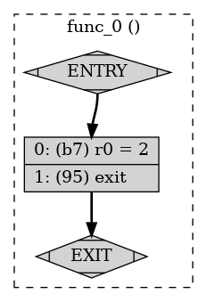

M# -**- fill-column: 76; -**-

---
layout: post
title: First Steps with XDP 
subtitle: Part One
tags: [ebpf, rust, linux]
---

# Running the first XDP Program

Welcome to the first step in this XDP tutorial.

The first eBPF  XDP program will be an exercise in building,
loading. This assumes that you have
already set up the pre requesists and installed the required tools
and libraries
Going through these steps will ensure that you can build an XDP program
using the Clang compiler, load it into the running linux kernel. The eBPF
program will load into the running kernel where it will be verified. 

The eBPF program will run in a virtual machine that is built into the Linux
kerenel. This virtual machine has nine general purpose registers R1-R9 and one 
read only register R10 that functions as a frame pointer. Clearly running anything
that can be loaded dyamically in the kernel with elevated privileges can 
be potential security issue. The eBPF virtual machine contains 
a verifier see <https://docs.kernel.org/bpf/verifier.html>
The verifier will check and reject if the program that contains:

-   loops
-   any type of pointer arithmetic
-   bounds or alignment violations
-   unreachable instructions

There are other restrictions, consult the documenation for more details

If you have worked with rust code with cargo before, you will have cycled 
through iterations of 

    cargo build
    cargo run

Where the source tree of a simple application would like:

    $ tree
    .
    ├── Cargo.toml
    └── src
        └── main.rs
    
    1 directory, 2 files

and after the application had been compiled:

    $ cargo build
       Compiling hello v0.1.0 (/tmp/hello)
        Finished dev [unoptimized + debuginfo] target(s) in 1.07s
    $ tree
    .
    ├── Cargo.lock
    ├── Cargo.toml
    ├── src
    │   └── main.rs
    └── target
        ├── CACHEDIR.TAG
        └── debug
            ├── build
            ├── deps
            │   ├── hello-20e1cfc616fb61ac
            │   └── hello-20e1cfc616fb61ac.d
            ├── examples
            ├── hello
            ├── hello.d
            └── incremental
                └── hello-3iozzekpyrysr
                    ├── s-gvk87j1cfi-6yflog-9nq5zq3lt8rcg1slvtqhu2l92
                    │   ├── 1cwggjlit3xor5e4.o
                    │   ├── 3nmgwmthvx9ijli.o
                    │   ├── 3qweoew2z2q7s3nh.o
                    │   ├── 4j2x83e2uqqcjw4i.o
                    │   ├── 4pluyvgu1vsjgq2o.o
                    │   ├── 54dgri4zf1sqnocs.o
                    │   ├── dep-graph.bin
                    │   ├── query-cache.bin
                    │   └── work-products.bin
                    └── s-gvk87j1cfi-6yflog.lock
    
    9 directories, 18 files

The compiled binary can be found in target/debug/hello and can be run 
directly from that location or by using cargo

    $ cargo run
        Finished dev [unoptimized + debuginfo] target(s) in 0.02s
         Running `target/debug/hello`
    Hello, world!

The aya framework creates two programs, an eBPF program that will 
be loaded into the kernel and userspace program that will be load the
eBPF program, and can also pass and receive data with the eBPF program.

Setting up the code framework will be set up using a template, this will 
set up a the eBPF code and the userspace program. 
The eBPF program will be compiled and run using a cargo 
workflow extension:

    cargo xtask build-ebpf

Compilation is a two stage process:

    cargo xtask build-ebpf
    cargo build

# Generating the code

Assuming that we have cargo and the generate extension have been installed, we
can generate the code, at the prompt select xdp-pass as the project name

Using the template, generate the code in directory \`xdp-pass\`, select the xdp option.

    $ cargo generate https://github.com/aya-rs/aya-template  
    ⚠️   Favorite `https://github.com/aya-rs/aya-template` not found in config, using it as a git repository: https://github.com/aya-rs/aya-template
    🤷   Project Name: xdp-pass
    🔧   Destination: /home/steve/articles/learning_ebpf_with_rust/xdp-tutorial/basic01-xdp-pass/xdp-pass ...
    🔧   project-name: xdp-pass ...
    🔧   Generating template ...
    ? 🤷   Which type of eBPF program? ›
      cgroup_skb
      cgroup_sockopt
      cgroup_sysctl
      classifier
      fentry
      fexit
      kprobe
      kretprobe
      lsm
      perf_event
      raw_tracepoint
      sk_msg
      sock_ops
      socket_filter
      tp_btf
      tracepoint
      uprobe
      uretprobe
    ❯ xdp

The generated files:

    $ tree xdp-pass/
    xdp-pass/
    ├── Cargo.toml
    ├── README.md
    ├── xdp-pass
    │   ├── Cargo.toml
    │   └── src
    │       └── main.rs
    ├── xdp-pass-common
    │   ├── Cargo.toml
    │   └── src
    │       └── lib.rs
    ├── xdp-pass-ebpf
    │   ├── Cargo.toml
    │   ├── rust-toolchain.toml
    │   └── src
    │       └── main.rs
    └── xtask
        ├── Cargo.toml
        └── src
            ├── build_ebpf.rs
            ├── main.rs
            └── run.rs
    
    8 directories, 13 files

Look at the file: <xdp-pass/xdp-pass-ebpf/src/main.rs> and modify so it looks like:

    #![no_std]
    #![no_main]
    
    use aya_ebpf::{bindings::xdp_action, macros::xdp, programs::XdpContext};
    
    #[xdp]
    pub fn xdp_pass(_ctx: XdpContext) -> u32 {
        xdp_action::XDP_PASS
    }
    
    #[panic_handler]
    fn panic(_info: &core::panic::PanicInfo) -> ! {
        unsafe { core::hint::unreachable_unchecked() }
    }

The templated code will run and return \`XDP\_PASS\` 

## Compile the code

    cargo xtask build-ebpf
    cargo build 

Compile in this order else the \`cargo build\` will fail.

The xtask step will generate the eBPF object file:
<./target/bpfel-unknown-none/debug/xdp-pass>

## Looking into the BPF-ELF object

eBPF bytecode is run in a virtual machine in the Linux kernel. There are 10 registers:

-   R0 stores function return values, and the exit value for an eBPF program
-   R1-R5 stores function arguments
-   R6-R9 are for general purpose usage
-   R10 stores adresses for the stack frame

Inspecting the sections of the eBPF file:

    $ llvm-readelf --sections target/bpfel-unknown-none/debug/xdp-pass
    There are 5 section headers, starting at offset 0x228:
    
    Section Headers:
      [Nr] Name              Type            Address          Off    Size   ES Flg Lk Inf Al
      [ 0]                   NULL            0000000000000000 000000 000000 00      0   0  0
      [ 1] .strtab           STRTAB          0000000000000000 0001c0 000068 00      0   0  1
      [ 2] .text             PROGBITS        0000000000000000 000040 000098 00  AX  0   0  8
      [ 3] xdp               PROGBITS        0000000000000000 0000d8 000010 00  AX  0   0  8
      [ 4] .symtab           SYMTAB          0000000000000000 0000e8 0000d8 18      1   6  8
    Key to Flags:
      W (write), A (alloc), X (execute), M (merge), S (strings), I (info),
      L (link order), O (extra OS processing required), G (group), T (TLS),
      C (compressed), x (unknown), o (OS specific), E (exclude),
      R (retain), p (processor specific)

We can see the xdp section we defined with the xdp macro in the code, so lets inspect that

    $ llvm-objdump --no-show-raw-insn --section=xdp  -S target/bpfel-unknown-none/debug/xdp-pass
    
    target/bpfel-unknown-none/debug/xdp-pass:       file format elf64-bpf
    
    Disassembly of section xdp:
    
    0000000000000000 <xdp_pass>:
           0:       r0 = 2
           1:       exit

Setting the r0 register to 2 corresponds to returning XDP\_PASS

Use the IOvisor documentation of the opcodes from here <https://github.com/iovisor/bpf-docs/blob/master/eBPF.md>

We can run the program using cargo, as its an XDP program we will have to specify a network interface. 
For this introductory example we can use the the loopback 
interface for convenioence:

    $ RUST_LOG=info cargo xtask run -- -i lo
        Finished dev [unoptimized + debuginfo] target(s) in 0.02s
         Running `target/debug/xtask run -- -i lo`
        Finished `dev` profile [optimized] target(s) in 0.10s
        Finished dev [unoptimized + debuginfo] target(s) in 0.09s
    [2024-04-28T06:14:44Z WARN  xdp_pass] failed to initialize eBPF logger: log event array AYA_LOGS doesn't exist
    [2024-04-28T06:14:44Z INFO  xdp_pass] Waiting for Ctrl-C...

We can also load eBPF prograns using iproute2

    sudo ip link set dev lo xdpgeneric obj   ./target/bpfel-unknown-none/debug/xdp-pass sec xdp

We can see the loaded program with bpftool:

    sudo bpftool prog | grep -A 5 xdp
    4509: xdp  name xdp_pass  tag 3b185187f1855c4c
            loaded_at 2024-04-28T09:15:17-0700  uid 0
            xlated 16B  jited 22B  memlock 4096B

We can generate a dump of the bytecode of the running eBPF bytecode using bpftool. Generate a dot file using bpftool and the id number for 4509 
from above.

    $ sudo bpftool prog dump xlated id 4509 visual &> 4509.dot

And then use that to generate an image file with graphviz

    $ dot -Tpng /tmp/4509.dot -o ~/4509.png

The comparable C version of the eBPF looks like:

    /* SPDX-License-Identifier: GPL-2.0 */
    #include <linux/bpf.h>
    #include <bpf/bpf_helpers.h>
    SEC("xdp")
    int  xdp_pass_func(struct xdp_md *ctx)
    {
    	return XDP_PASS;
    }
    
    char _license[] SEC("license") = "GPL";

Which would be compiled like:

    clang -O2 -target bpf -c ebpf_program.c -o ebpf_program.oh

And loaded:

    $ sudo  ip link set dev lo xdpgeneric obj   ./xdp_pass.o sec xdp                                                                                                                                                                        
    $ sudo ip link show dev lo                                                                                                                                                                                                              
    1: lo: <LOOPBACK,UP,LOWER_UP> mtu 65536 xdpgeneric qdisc noqueue state UNKNOWN mode DEFAULT group default qlen 1000                                                                                                                                                                
        link/loopback 00:00:00:00:00:00 brd 00:00:00:00:00:00                                                                                                                                                                                                                          
        prog/xdp id 4529 tag 3b185187f1855c4c jited                         

Dumping the bytecode shows similar sections,

    $ llvm-readelf --sections xdp_pass.o
    There are 7 section headers, starting at offset 0x108:
    
    Section Headers:
      [Nr] Name              Type            Address          Off    Size   ES Flg Lk Inf Al
      [ 0]                   NULL            0000000000000000 000000 000000 00      0   0  0
      [ 1] .strtab           STRTAB          0000000000000000 0000ba 00004e 00      0   0  1
      [ 2] .text             PROGBITS        0000000000000000 000040 000000 00  AX  0   0  4
      [ 3] xdp               PROGBITS        0000000000000000 000040 000010 00  AX  0   0  8
      [ 4] license           PROGBITS        0000000000000000 000050 000004 00  WA  0   0  1
      [ 5] .llvm_addrsig     LLVM_ADDRSIG    0000000000000000 0000b8 000002 00   E  6   0  1
      [ 6] .symtab           SYMTAB          0000000000000000 000058 000060 18      1   2  8
    Key to Flags:
      W (write), A (alloc), X (execute), M (merge), S (strings), I (info),
      L (link order), O (extra OS processing required), G (group), T (TLS),
      C (compressed), x (unknown), o (OS specific), E (exclude),
      R (retain), p (processor specific)

Dissasembly is the same as the Rust version:

    steve@Peshawer:~/git/aya_discovery/xdp_pass$ llvm-objdump --no-show-raw-insn --section=xdp  -S ./xdp_pass.o
    
    ./xdp_pass.o:   file format elf64-bpf
    
    Disassembly of section xdp:
    
    0000000000000000 <xdp_pass_func_02>:
           0:       r0 = 2
           1:       exit

# Summary

-   We can use Rust with the aya crate to build eBPF programs
-   Load and unload the eBPF programs we created using 
    -   Cargo
    -   ip net2
-   Dissasemble the byte code using 
    -   llvm-objdump
-   Generate graphics to aid in debugging using graophviz.

